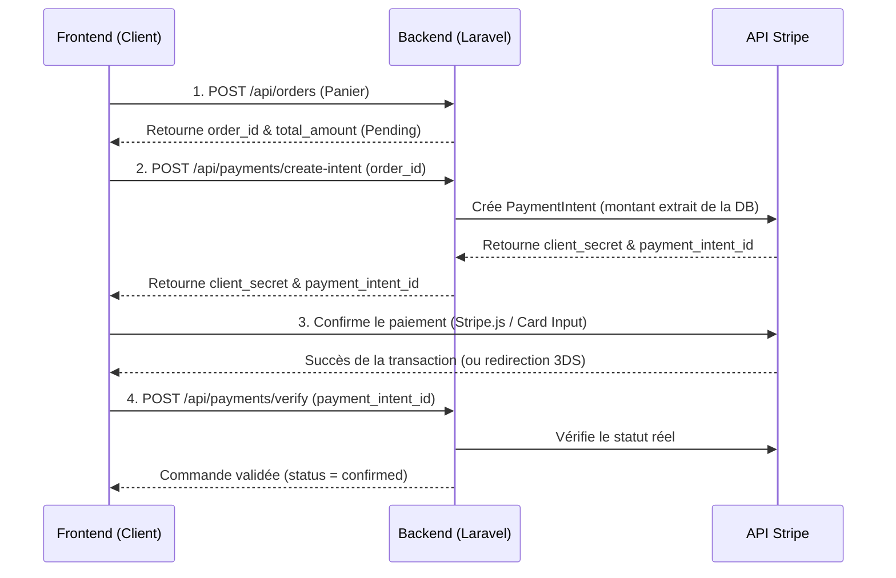

# Guide d'Intégration Frontend : Paiement Stripe & Commandes

Ce document est un guide destiné à une IA assistante chargée d'implémenter le tunnel d'achat et le paiement Stripe côté frontend. Il détaille le flux optimal, les endpoints API du backend à consommer, et les meilleures pratiques d'implémentation.

---

## Architecture Générale du Flux



---

## 🛠️ Endpoints Backend à Consommer

### 1. Créer la commande
- **Endpoint :** `POST /api/orders`
- **Authentification :** Non requise (Supporte les commandes invités et connectées)
- **Corps (JSON) :**
  ```json
  {
    "delivery_option_id": "uuid-option-livraison",
    "payment_method": "stripe",
    "shipping_address": {
      "first_name": "John",
      "last_name": "Doe",
      "email": "john.doe@example.com",
      "phone": "+33612345678",
      "address": "12 rue de Rivoli",
      "city": "Paris",
      "postal_code": "75001",
      "country": "FR"
    },
    "items": [
      { "product_id": "uuid-produit-1", "quantity": 2 },
      { "product_id": "uuid-produit-2", "quantity": 1 }
    ]
  }
  ```
- **Réponse attendue (201) :**
  ```json
  {
    "id": "550e8400-e29b-41d4-a716-446655440000",
    "reference": "ORD-2026-00012",
    "total_amount": 99.99,
    "status": "pending"
  }
  ```

### 2. Créer l'Intent de paiement Stripe
- **Endpoint :** `POST /api/payments/create-intent`
- **Authentification :** Recommandée (Bearer Token si connecté)
- **Corps (JSON) :**
  ```json
  {
    "order_id": "550e8400-e29b-41d4-a716-446655440000"
  }
  ```
  *(Note : Le montant n'est pas envoyé par le client pour des raisons de sécurité, le backend le calcule depuis la commande).*
- **Réponse attendue (200) :**
  ```json
  {
    "success": true,
    "client_secret": "pi_xxx_secret_yyy",
    "payment_intent_id": "pi_xxx",
    "amount": 99.99,
    "currency": "eur"
  }
  ```

### 3. Vérifier et finaliser le paiement
- **Endpoint :** `POST /api/payments/verify`
- **Authentification :** Recommandée
- **Corps (JSON) :**
  ```json
  {
    "payment_intent_id": "pi_xxx"
  }
  ```
- **Réponse attendue (200) :**
  ```json
  {
    "success": true,
    "message": "Paiement confirmé et commande mise à jour",
    "order_id": "550e8400-e29b-41d4-a716-446655440000"
  }
  ```

### 4. Lire le statut d'une commande (Polling de secours)
- **Endpoint :** `GET /api/orders/{order_id}`
- **Réponse attendue (200) :**
  ```json
  {
    "id": "550e8400-e29b-41d4-a716-446655440000",
    "status": "confirmed" // Si le paiement a été validé par webhook
  }
  ```

---

## 💻 Exemple d'Implémentation Technique (React / TypeScript)

### 1. Installation des dépendances Stripe
```bash
npm install @stripe/stripe-js @stripe/react-stripe-js
```

### 2. Initialisation du Provider Stripe
Entourez votre page de Checkout avec le Provider Stripe une fois que vous avez récupéré le `client_secret` :

```typescript
import { useEffect, useState } from 'react';
import { loadStripe } from '@stripe/stripe-js';
import { Elements } from '@stripe/react-stripe-js';
import CheckoutForm from './CheckoutForm';

const stripePromise = loadStripe(process.env.NEXT_PUBLIC_STRIPE_PUBLISHABLE_KEY!);

export default function CheckoutPage() {
  const [clientSecret, setClientSecret] = useState<string | null>(null);
  const [orderId, setOrderId] = useState<string | null>(null);

  const handleCheckoutInit = async () => {
    // 1. Créer la commande
    const orderRes = await fetch('/api/orders', { method: 'POST', body: JSON.stringify({...}) });
    const orderData = await orderRes.json();
    setOrderId(orderData.id);

    // 2. Créer le PaymentIntent
    const paymentRes = await fetch('/api/payments/create-intent', {
      method: 'POST',
      headers: { 'Content-Type': 'application/json' },
      body: JSON.stringify({ order_id: orderData.id }),
    });
    const paymentData = await paymentRes.json();
    setClientSecret(paymentData.client_secret);
  };

  return (
    <div>
      {clientSecret && orderId ? (
        <Elements stripe={stripePromise} options={{ clientSecret }}>
          <CheckoutForm orderId={orderId} />
        </Elements>
      ) : (
        <button onClick={handleCheckoutInit}>Procéder au paiement</button>
      )}
    </div>
  );
}
```

### 3. Composant Formulaire de Paiement (`CheckoutForm.tsx`)
Ce composant gère la saisie de carte bancaire de manière sécurisée grâce à Stripe Elements.

```typescript
import { useState, FormEvent } from 'react';
import { PaymentElement, useStripe, useElements } from '@stripe/react-stripe-js';

interface CheckoutFormProps {
  orderId: string;
}

export default function CheckoutForm({ orderId }: CheckoutFormProps) {
  const stripe = useStripe();
  const elements = useElements();
  const [errorMessage, setErrorMessage] = useState<string | null>(null);
  const [loading, setLoading] = useState<boolean>(false);

  const handleSubmit = async (e: FormEvent) => {
    e.preventDefault();

    if (!stripe || !elements) return;

    setLoading(true);
    setErrorMessage(null);

    // Déclencher la confirmation Stripe (gère 3DS et validations)
    const { error, paymentIntent } = await stripe.confirmPayment({
      elements,
      confirmParams: {
        // Redirige l'utilisateur vers cette page après confirmation
        return_url: `${window.location.origin}/checkout/success?order_id=${orderId}`,
      },
      redirect: 'if_required', // Ne pas rediriger si 3DS n'est pas requis
    });

    if (error) {
      setErrorMessage(error.message || "Une erreur est survenue lors du paiement.");
      setLoading(false);
      return;
    }

    // Si pas de redirection nécessaire, valider immédiatement auprès du backend
    if (paymentIntent && paymentIntent.status === 'succeeded') {
      try {
        const verifyRes = await fetch('/api/payments/verify', {
          method: 'POST',
          headers: { 'Content-Type': 'application/json' },
          body: JSON.stringify({ payment_intent_id: paymentIntent.id }),
        });
        const verifyData = await verifyRes.json();

        if (verifyData.success) {
          window.location.href = `/checkout/success?order_id=${orderId}`;
        } else {
          setErrorMessage("Échec de la validation de la commande.");
        }
      } catch (err) {
        setErrorMessage("Erreur de connexion avec le serveur.");
      }
    }
    setLoading(false);
  };

  return (
    <form onSubmit={handleSubmit} className="max-w-md mx-auto p-4 bg-slate-900 rounded-lg">
      <PaymentElement />
      {errorMessage && <div className="text-red-500 mt-2">{errorMessage}</div>}
      <button 
        disabled={!stripe || loading} 
        className="w-full mt-4 bg-violet-600 text-white py-2 rounded-md disabled:bg-slate-700"
      >
        {loading ? 'Traitement...' : 'Confirmer le paiement'}
      </button>
    </form>
  );
}
```

---

## ⚠️ Robustesse et Tolérance aux Pannes (Must-Have UX)

### Polling de secours sur la page de succès
Si le client ferme sa page internet, a une coupure de courant ou de réseau juste après avoir autorisé son paiement Stripe (3DS) :
1. Stripe va quand même encaisser l'argent.
2. Le **Webhook du backend** va recevoir la confirmation et passer le statut de la commande à `confirmed` de son côté.
3. Lorsque l'utilisateur revient sur le site ou rafraîchit la page `/checkout/success?order_id=XXX`, le frontend doit :
   - Envoyer l'appel de vérification `/api/payments/verify`.
   - **En cas d'échec de la requête réseau :** Mettre en place un intervalle (polling) qui appelle `GET /api/orders/XXX` toutes les 3 secondes pour vérifier si le statut de la commande passe à `confirmed`.
   - Une fois la commande détectée comme confirmée par le polling, afficher le message de succès de manière transparente pour l'utilisateur.
